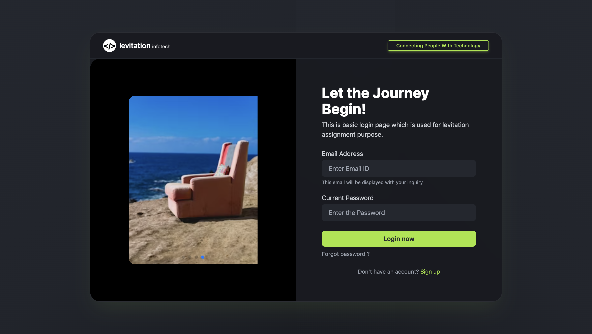
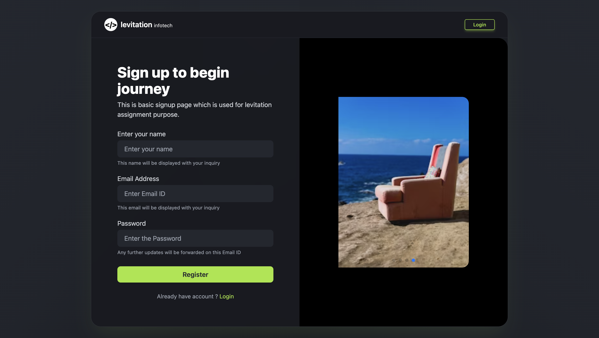
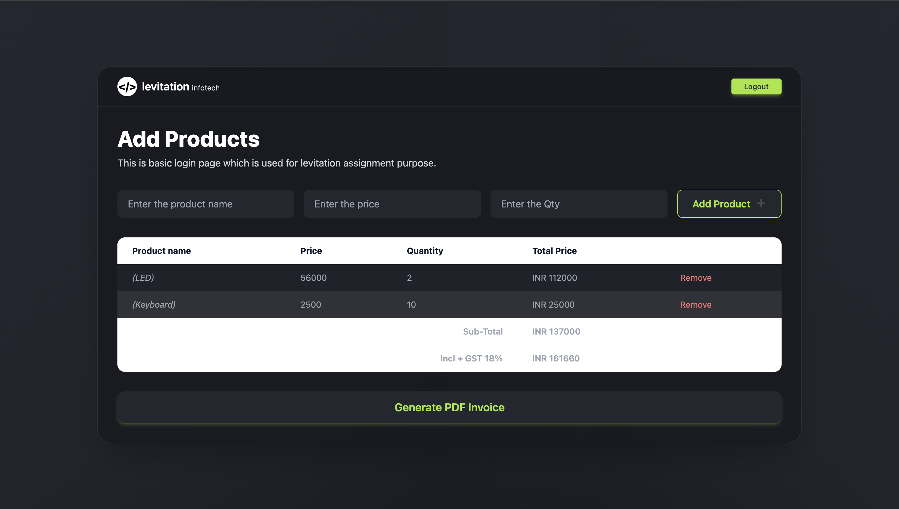
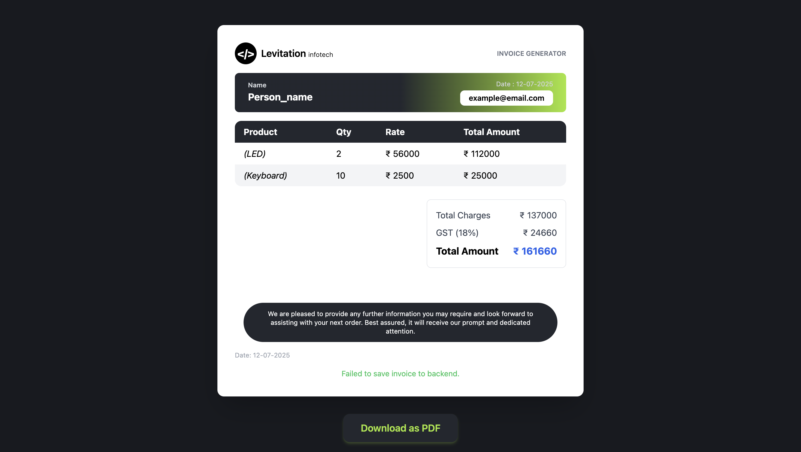

# MERN Stack PDF Generator


---

## 🚀 Project Overview

A **pixel-perfect** MERN stack application to generate beautiful, downloadable PDF invoices. Features a modern UI, product management, and seamless PDF export—all styled with Tailwind CSS.

---

## ✨ Features

- 🔒 **Authentication**: Secure login & signup pages
- 🛒 **Product Management**: Add, edit, and remove products
- 🧾 **Invoice Generation**: Create invoices with GST, totals, and customer details
- 📄 **PDF Export**: Download invoices as PDF (and image, coming soon)
- 🎨 **Modern UI**: Fully responsive, dark-themed, and pixel-perfect
- ⚡ **React Context**: Global state management for products and invoices

---

## 📸 Screenshots

### Login Page


### Signup Page


### Add Products Page


### Invoice Preview Page


---

## 🛠️ Getting Started

### 1. Clone the repository
```bash
git clone https://github.com/your-username/mern-stack-pdf-generator.git
cd mern-stack-pdf-generator
```

### 2. Install dependencies
```bash
# Install backend dependencies
cd backend
npm install

# Install frontend dependencies
cd ../frontend
npm install
```

### 3. Configure Environment
- Create a `.env` file in `/backend` with your MongoDB URI and JWT secret:
  ```env
  MONGO_URI=your_mongodb_uri
  JWT_SECRET=your_jwt_secret
  ```

### 4. Run the app
```bash
# In the project root
yarn dev
# or
npm run dev
```
- Frontend: [http://localhost:5173](http://localhost:5173)
- Backend: [http://localhost:5050](http://localhost:5050)

---

## 🧩 Project Structure
```
MERN-Stack-PDF-Generator/
  backend/         # Express, MongoDB, Auth, PDF generation
  frontend/        # React, Tailwind CSS, UI, Context
```

---

## 🤝 Credits
- UI/UX inspired by [Levitation Infotech](https://levitation.in/)
- Built with [React](https://reactjs.org/), [Express](https://expressjs.com/), [MongoDB](https://www.mongodb.com/), [Tailwind CSS](https://tailwindcss.com/)

---

## 📄 License

This project is licensed under the MIT License.
